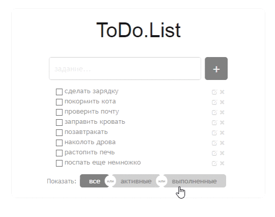

# ToDo-List-App (Список дел)

## Описание

Приложение предназначено для записи, учета и хранения текущего списка дел в виде простых заметок.

В приложении предусмотрена возможность добавления, редактирования и удаления дел из списка.
Также предусмотрена фильтрация текущего списка дел:
- можно посмотреть весь список, включая все дела не зависимо от их статуса или 
- ознакомиться с теми делами которые уже выполнены или которые еще только предстоит выполнить; 

## Дополнительно

При добавлении в список более 10 дел, список автоматически прокручивается, смещаясь вверх.

